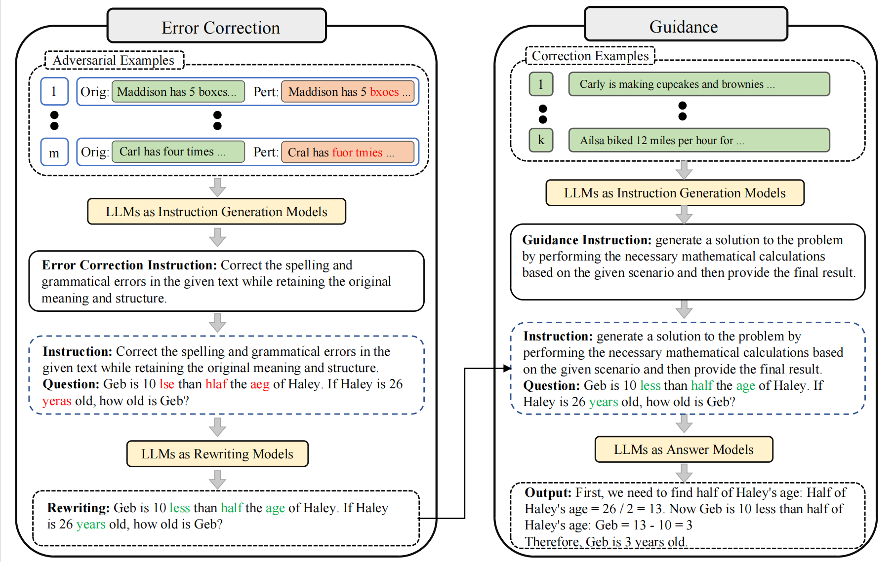

# Robustness-of-Prompting
Robustness of Prompting: Enhancing Robustness of Large Language Models Against Prompt Attacks



## Perturbation Types

| Type                    | Code | Description                           | Example                         |
| ----------------------- | ---- | ------------------------------------- | ------------------------------- |
| Error Character         | EC   | Shuffle internal characters of words  | `times → tmies`                 |
| Similar Character       | SC   | Replace with visually similar symbols | `will → wil̈l`                   |
| Words Out of Order      | WOO  | Swap neighboring word positions       | `6 times older → older 6 times` |
| Homophone Words         | HW   | Replace with phonetic equivalents     | `be → bee`                      |
| Unaffected Interference | UIC  | Append irrelevant but plausible info  | Adds unrelated sentences        |

## Pipeline (4 Steps)

```
Step 1: Perturbation       — Generate adversarial examples from clean questions
Step 2: APE Instruction    — Auto-generate Error Correction & Guidance instructions
Step 3: Error Correction   — Apply correction instruction to fix perturbed inputs
Step 4: Guidance & Answer  — Apply guidance instruction to answer corrected inputs
```

## Quick Start

Set your API key as an environment variable (never hardcode keys):

```bash
export OPENAI_API_KEY="sk-..."
export OPENAI_BASE_URL="https://api.openai.com/v1"   # or your proxy
```


```bash
# Step 1: Generate adversarial examples
python scripts/step1_perturb.py --dataset aqua --perturb_type EC --output_dir results/aqua/EC

# Step 2: Generate APE instructions (error correction + guidance)
python scripts/step2_generate_instructions.py --data_dir results/aqua/EC

# Step 3: Apply error correction
python scripts/step3_correct.py --data_dir results/aqua/EC

# Step 4: Answer with guidance prompt
python scripts/step4_answer.py --data_dir results/aqua/EC
```

## Configuration

Edit `configs/default.yaml` to change models, datasets, and hyperparameters.  
Dataset paths are configured in `configs/datasets.yaml`.

## Datasets

Place datasets under `data/` following this structure:

```
data/
├── AQuA/test.json
├── GSM8K/test.jsonl
├── SingleEq/questions.json
├── AddSub/AddSub.json
├── MultiArith/MultiArith.json
├── SVAMP/SVAMP.json
├── CommonsenseQA/dev_rand_split.jsonl
├── StrategyQA/task.json
└── Bigbench/
    ├── date_understanding/task.json
    └── tracking_shuffled_objects/task.json
```

## Project Structure

```
RoP/
├── README.md
├── configs/
│   ├── default.yaml          # Model & runtime settings
│   └── datasets.yaml         # Dataset paths
├── rop/                      # Core library
│   ├── llm/
│   │   └── client.py         # Unified LLM API client
│   ├── perturbation/
│   │   └── perturber.py      # 5 perturbation strategies
│   ├── correction/
│   │   └── corrector.py      # Stage 1: Error correction
│   ├── guidance/
│   │   └── answerer.py       # Stage 2: Guided answering
│   ├── ape/
│   │   └── instruction_gen.py # APE-based instruction generation
│   └── utils/
│       ├── data.py           # Data loading & saving
│       └── metrics.py        # Accuracy evaluation
├── scripts/                  # Executable pipeline steps
│   ├── step1_perturb.py
│   ├── step2_generate_instructions.py
│   ├── step3_correct.py
│   └── step4_answer.py
├── data/                     # Datasets
├── results/                  # Experiment outputs
└── tests/
    └── test_pipeline.py
```

## 
